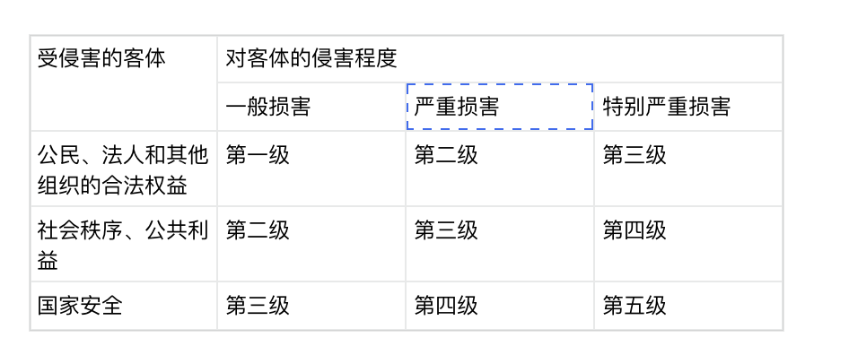

# tools

- docker
- docker compose
  - k8s, kubernetes
- Juice Shop

---

# Architecture

**这个架构能适用所有场景吗 ?**

```
                         攻击者
                            │
                            ▼
                     ┌─────────────┐
                     │  Firewall   │
                     └──────┬──────┘
                            │
                            ▼
                     ┌─────────────┐
                     │     WAF     │ 
                     └──────┬──────┘
                            │
                            ▼
                     ┌─────────────┐
                     │  *Business* │ 
                     └──────┬──────┘
              ┌─────────────┴─────────────┐
              ▼                           ▼
       ┌─────────────┐             ┌─────────────┐
       │  Suricata   │             │   Wazuh     │
       │    NIDS     │             │    HIDS     │
       └──────┬──────┘             └──────┬──────┘
              └─────────────┬─────────────┘
                            ▼
                     ┌─────────────┐
                     │    SIEM     │ 
                     │   Wazuh     │
                     └──────┬──────┘
                            ▼
                     ┌─────────────┐
                     │  Dashboard  │ 
                     └─────────────┘
```

---

# 什么是安全

> 安全是一种业务管理工具，旨在确保 IT/IS 的运行可靠且受到保护。安全的存在是为了支持组织的目标、使命和宗旨。

# 安全的目标


# 安全工作


# 标准

抓手

CC

ISO 27000, ISO 27001

