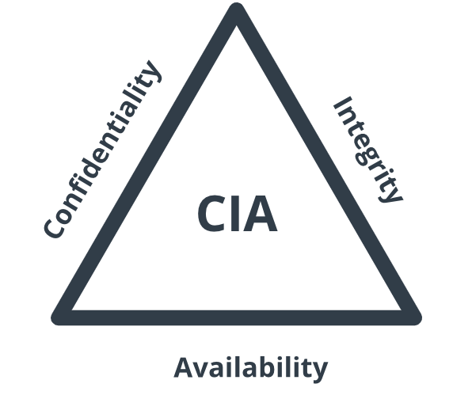

## 安全的目标: CIA



## 安全标准

| 类别 | 标准/框架 |
|---|---|
| 国际权威参考 | NIST 网络安全框架（CSF 2.0）|
| 行业强制 | PCI DSS（支付卡）、HIPAA（美国医疗）、SOX（上市公司内控）|
| 应用安全 | OWASP |
| 隐私与数据 | GDPR（欧盟）、中国《数据安全法》《个人信息保护法》|
| 治理与连续性 | COBIT（IT 治理框架） |

### PCI DSS

### GDPR

---

## 安全概念

- 纵深防御
- DMZ

---

## 宏观架构

宏观架构，不会迷路

```
                         攻击者
                            │
                            ▼
                     ┌─────────────┐
                     │  Firewall   │
                     └──────┬──────┘
                            │
                            ▼
                     ┌─────────────┐
                     │     WAF     │ 
                     └──────┬──────┘
                            │
                            ▼
                     ┌─────────────┐
                     │  *Business* │ 
                     └──────┬──────┘
              ┌─────────────┴─────────────┐
              ▼                           ▼
       ┌─────────────┐             ┌─────────────┐
       │  Suricata   │             │   Wazuh     │
       │    NIDS     │             │    HIDS     │
       └──────┬──────┘             └──────┬──────┘
              └─────────────┬─────────────┘
                            ▼
                     ┌─────────────┐
                     │    SIEM     │ 
                     │   Wazuh     │
                     └──────┬──────┘
                            ▼
                     ┌─────────────┐
                     │  Dashboard  │ 
                     └─────────────┘
```

---

## 技术细节

技术很有意思，但不要沉迷其中，关注**业务目标**。

- network
  - OSI
  - http, tcp, udp, ip
- 教学演示
  - docker, docker compose
  - Juice Shop
  - curl
- 企业环境 (devops)
  - dev
    - programming language: bash, python, java, go, typescript
    - 业务的三层架构
      - frontend: vue, react
      - backend: springboot, node.js
      - database: sqlite, mysql, postgres
  - ops: docker, k8s
- others: claude code, git, vi, linux (ubuntu, centos)
- **security**: modsecurity (WAF)
  - 建议: 部署 雷池 SafeLine, 与 modsecurity 做对比
