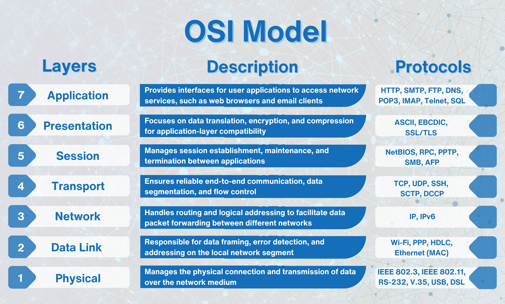

# Security Lab Lesson 02 教师讲稿

## SQL 注入正在发生——部署第一道防线

---

# 上节课留下的问题

上一节课，我们没有部署任何安全设备，就把一个 Web 应用上线了，任何人都可以直接访问 Web 应用，包括攻击者。

更重要的是，我们尝试了 SQL Injection。在没有任何阻拦的情况下，攻击者可以让数据库执行原本不应该执行的操作。

> 那么，如果攻击者开始攻击我们的服务，有什么东西可以挡住他？”

这个问题就进入了我们今天的课程。

---

# 今天的任务：给 Web 应用加一道防线

今天我们的任务非常明确：

> **在攻击者和 Web 应用之间增加一道安全防线。**

上节课的结构是：

```text
攻击者
   │
   ▼
Juice Shop
```

攻击者的 HTTP 请求直接到达应用。

今天我们要改成：

```text
攻击者
   │
   ▼
   WAF
   │
   ▼
Juice Shop
```

也就是说：

> **所有进入 Web 应用的 HTTP 请求，先经过 WAF。**

如果 WAF 判断这个请求是恶意请求，就直接把它挡下来。

如果请求看起来正常，再把它转发给后端应用。

这就是今天最核心的一件事情。

---

# 先认识 WAF

WAF 是什么？

WAF 是： **Web Application Firewall**

中文一般叫： **Web 应用防火墙**

注意这里有一个非常重要的词：

**Web Application。**

它不是一个普通的网络防火墙。

普通防火墙主要解决的问题是：“这个 IP 能不能访问这个端口？”

例如：

```text
192.168.1.100 → 10.0.0.10:22
```

防火墙可能判断：

> TCP 22 端口允许不允许访问？

而 WAF 关心的问题完全不同。

WAF 会进一步看：

- 你访问的是 HTTP 吗？
- 你的 URL 是什么？
- 你的 HTTP 参数是什么？
- 你的 Cookie 是什么？
- 你的请求里面有没有明显的 SQL Injection 特征？
- 有没有 XSS 的攻击特征？

这就是为什么 WAF 能够检测 SQL Injection。

因为 SQL Injection 往往发生在：

> **HTTP 请求的数据里面。**

---

# 为什么 WAF 能看到 SQL Injection？

这里我建议大家想象一个真实的 HTTP 请求。

例如我们实验里面的请求：

```text
GET /rest/products/search?q=' OR 1=1 --
```

从网络的角度看，这只是一个 HTTP 请求。

但是 WAF 把 HTTP 请求解析出来以后，可以看到：

```text
Method:
GET

URL:
/rest/products/search

Parameter:
q=' OR 1=1 --
```

然后 ModSecurity 就可以把这些内容交给规则进行检查。

例如规则发现：

```text
' OR 1=1
```

这是非常典型的 SQL Injection 特征。

那么 WAF 可以直接拒绝：

```text
HTTP 403 Forbidden
```

请求甚至不会到达 Juice Shop。

这里有一个非常重要的安全思想：

> **最好的攻击检测位置之一，就是攻击真正到达应用之前。**

因为一旦恶意请求已经进入应用，后面的数据库、业务逻辑、文件系统都有可能受到影响。

---

# 五、WAF 在整个网络里面到底处于什么位置？

### 15～25 分钟

现在我们进入今天第一个比较重要的网络知识：

> **WAF 到底工作在哪一层？**

PPT 中给出的结论是：

> WAF 工作在 OSI 第 7 层，也就是 Application Layer。

但是要理解这句话，我们必须先理解：

# OSI 七层模型



---

## 1. 第一层：Physical Layer

第一层：

**物理层 Physical Layer**

关注的是：

> 比特到底怎么在物理介质上传输？

例如：

* 网线
* 光纤
* 无线电信号

这些属于非常底层的问题。

我们今天基本不会直接处理这一层。

---

## 2. 第二层：Data Link Layer

第二层：

**数据链路层 Data Link Layer**

典型概念就是：

> MAC Address

例如：

```text
AA:BB:CC:DD:EE:FF
```

交换机主要工作在这一层。

它关心的是：

> “这个数据帧应该从哪个端口转出去？”

---

## 3. 第三层：Network Layer

第三层：

**网络层 Network Layer**

这里最重要的概念就是：

> IP Address

例如：

```text
192.168.1.10
10.0.0.20
```

路由器主要在这一层工作。

它解决的问题是：

> “这个 IP 数据包应该往哪里走？”

所以我们说：

```text
L3 → IP
```

---

## 4. 第四层：Transport Layer

第四层：

**传输层 Transport Layer**

最典型的是：

```text
TCP
UDP
```

同时还有：

```text
Port
```

例如：

```text
TCP 80
TCP 443
TCP 22
```

所以当我们说：

> “服务器开放了 80 端口。”

实际上我们讨论的是传输层。

这一层解决的是：

> “数据应该交给哪个应用服务？”

---

## 5. 第五、六层

第五层：

**Session Layer**

第六层：

**Presentation Layer**

这两个层在现代互联网开发中经常没有那么明显的边界。

例如：

* Session
* 数据表示
* 编码
* 加密

很多时候已经和应用层的实现融合在一起了。

所以实际工程里面，大家更常讨论：

```text
L2
L3
L4
L7
```

---

# 六、第七层：Application Layer

### 20～25 分钟

第七层：

**Application Layer**

也就是：

> 应用层。

这里就出现了我们今天真正关心的东西：

```text
HTTP
HTTPS
DNS
SMTP
SSH
```

等等。

比如我们访问：

```text
http://localhost:80
```

实际上发生了很多层次的事情。

可以简单理解成：

```text
Application
HTTP
   ↓
Transport
TCP : 80
   ↓
Network
IP
   ↓
Data Link
Ethernet
   ↓
Physical
```

所以当 WAF 说：

> “我要检查这个 HTTP 请求里面有没有 SQL Injection。”

它必须能够理解：

```text
HTTP
URL
Header
Cookie
Parameter
Body
```

因此 WAF 主要工作在：

> **OSI Layer 7，也就是应用层。**

---

# 七、不同安全设备看见的东西不一样

这是今天我希望大家真正理解的一个知识点。

假设攻击者发送：

```text
GET /search?q=' OR 1=1 --
```

不同层的设备看到的信息是不一样的。

---

### L3/L4 防火墙

它可能看到：

```text
Source IP
Destination IP
Protocol
Source Port
Destination Port
```

例如：

```text
10.0.0.100
      ↓
10.0.0.20:80
TCP
```

它可能会问：

> “这个 IP 能不能访问 80 端口？”

但是它通常并不负责理解：

```text
q=' OR 1=1 --
```

---

### WAF

WAF 可以进一步看到：

```text
GET /search?q=' OR 1=1 --
```

所以它能够判断：

> “这个 HTTP 请求里面可能存在 SQL Injection。”

---

# 那么 DMZ 又是什么？

现在我们来看第二个非常重要的概念：

# DMZ

通常翻译为：**非军事区**

大家可以把它简单理解成：

> **处在互联网和内部网络之间的一个隔离区域。**

为什么需要 DMZ？

假设公司有一个 Web Server。

这个 Web Server 必须让互联网用户访问。

那么问题来了：

如果把 Web Server 直接放在公司内部网络里，会怎么样？

结构可能是：

```text
Internet
    │
    ▼
Web Server
    │
    ▼
Internal Network
```

如果 Web Server 被攻破，攻击者就可能进一步进入内部网络。

所以我们希望：

> **即使 Web Server 被攻破，也不要让攻击者轻易进入内部网络。**

于是我们把它放进一个隔离区域：

```text
                    Internet
                        │
                        ▼
                  ┌──────────┐
                  │ Firewall │
                  └────┬─────┘
                       │
                       ▼
                  ┌──────────┐
                  │   DMZ    │
                  │          │
                  │ Web/WAF  │
                  └────┬─────┘
                       │
                  ┌────▼─────┐
                  │ Firewall │
                  └────┬─────┘
                       │
                       ▼
                Internal Network
```

这就是一个典型的 DMZ 思想。

---

# DMZ 的核心不是“一个特殊的网络”

这里有一个容易产生误解的地方。

DMZ 并不是说：

> “存在一种叫 DMZ 的特殊网络协议。”

不是。

DMZ 本质上是一种：

> **网络隔离和安全架构思想。**

通常通过：

* Firewall
* VLAN
* Router
* Security Group
* Network ACL
* 多个网络接口

等等方式，把不同安全区域隔离开。

所以我们可以把它理解成：

```text
Internet
   │
   │ 不可信
   ▼
 DMZ
   │
   │ 半可信
   ▼
Internal Network
   │
   │ 更可信
   ▼
Critical Systems
```

当然，“可信”并不是绝对可信。

现代安全架构越来越强调：

> **不要因为一个系统在内部网络，就默认它安全。**

这就是后面 Zero Trust 等思想的基础之一。

---

# 我们的 Security Lab 里面有没有 DMZ？

有。

虽然我们的实验环境非常简单，但是实际上已经把 DMZ 的思想体现出来了。

我们的 Docker Compose 定义了两个网络：

```text
dmz-net
app-net
```

其中：

```text
dmz-net
```

是 WAF 所在的网络，对外暴露。

而：

```text
app-net
```

是后端应用网络。

并且：

```yaml
internal: true
```

这意味着 app-net 被设计成内部网络。

我们的架构实际上是：

```text
                 Internet
                    │
                    │ :80
                    ▼
          ┌──────────────────┐
          │ Nginx +           │
          │ ModSecurity WAF   │
          │                  │
          │    DMZ Network   │
          └────────┬─────────┘
                   │
                   │ app-net
                   ▼
          ┌──────────────────┐
          │   Juice Shop     │
          │                  │
          │   Internal       │
          └──────────────────┘
```

从 Docker Compose 配置也可以看到：

WAF 同时连接：

```text
dmz-net
app-net
```

而 Juice Shop 只连接：

```text
app-net
```

因此 Juice Shop 并没有直接暴露到宿主机的端口。

这一点非常重要。

Juice Shop 在内部网络中通过：

```text
3000
```

端口提供服务，而 WAF 通过：

```text
BACKEND=http://juice-shop:3000
```

把请求转发给它。

所以大家可以把我们的实验理解成一个非常简化的：

> **Internet → DMZ → Internal Application**

架构。

---


---

# 十三、WAF 开始工作

### 45～50 分钟

现在我们启动 WAF。

我们的环境中使用：

```text
Nginx
+
ModSecurity
+
OWASP CRS
```

其中三个东西分别负责什么？

---

## Nginx

Nginx 是 Web Server / Reverse Proxy。

它负责：

```text
接收 HTTP 请求
        ↓
转发 HTTP 请求
```

---

## ModSecurity

ModSecurity 是 Web Application Firewall 引擎。

它负责：

```text
分析 HTTP 请求
        ↓
执行安全规则
        ↓
决定是否允许
```

---

## OWASP CRS

CRS：

**OWASP Core Rule Set**

可以理解成：

> **一套已经准备好的 Web 攻击检测规则。**

它里面包含大量针对常见 Web 攻击的规则，例如：

```text
SQL Injection
XSS
File Inclusion
Command Injection
HTTP Protocol Violations
```

所以可以把三者理解成：

```text
Nginx
  ↓
负责接待 HTTP 请求

ModSecurity
  ↓
负责执行 WAF 检测

OWASP CRS
  ↓
提供攻击检测规则
```

---

# 十四、实验：正常请求

### 50～53 分钟

现在先不要攻击。

我们先访问：

```bash
curl http://localhost:80
```

这是一个正常请求。

WAF 检查：

```text
正常
```

于是：

```text
Client
  ↓
WAF
  ↓
Juice Shop
```

页面正常返回。

这一步非常重要。

因为一个安全设备不能只会：

> “拦攻击。”

它还必须：

> **允许正常业务运行。**

否则安全设备本身就会成为业务故障来源。

所以安全工程里面一直存在一个平衡：

```text
Security
    ↕
Availability
    ↕
Usability
```

---

# 十五、实验：SQL Injection

### 53～56 分钟

现在我们发起 SQL Injection：

```bash
curl "http://localhost:80/rest/products/search?q=%27%20OR%201%3D1%20--"
```

这里的 URL 编码实际上对应：

```text
' OR 1=1 --
```

我们希望看到什么？

不是 Juice Shop 返回正常结果。

而是：

```text
HTTP 403
```

为什么？

因为：

```text
Client
  │
  ▼
Nginx
  │
  ▼
ModSecurity
  │
  ▼
OWASP CRS
  │
  ▼
发现攻击特征
  │
  ▼
403 Forbidden
```

请求在这里就结束了。

它根本没有继续进入 Juice Shop。

这就是 WAF 的核心价值。

---

# 十六、再测试 XSS

### 56～58 分钟

我们再测试一种攻击：

**XSS**

Cross-Site Scripting。

例如：

```html
<script>alert(1)</script>
```

攻击者希望把 JavaScript 注入网页。

如果应用把这些内容原样返回给其他用户，就可能导致：

```text
恶意 JavaScript
        ↓
受害者浏览器执行
        ↓
Cookie / Session / 页面操作
```

WAF 同样可以利用规则检测一些典型 XSS 攻击模式。

我们的实验中：

```bash
curl "http://localhost:80/?q=%3Cscript%3Ealert(1)%3C/script%3E"
```

预期同样会被：

```text
403 Forbidden
```

拦截。

---

# 十七、但是 WAF 不是万能的

### 58～61 分钟

现在大家可能会产生一个错误认识：

> “既然 WAF 能拦 SQL Injection 和 XSS，那部署 WAF 以后是不是就安全了？”

答案是：

**不是。**

这恰恰是今天最重要的一个结论。

我们的 CISO 观察表里面已经非常清楚：

```text
WAF
    ✅ SQL Injection
    ✅ XSS

但是：

端口扫描
    ❌

主机文件篡改
    ❌
```

为什么？

因为 WAF 的职责是：

> **Web Application Security。**

它主要观察：

```text
HTTP / HTTPS
```

它并不负责整个网络。

例如攻击者开始扫描：

```text
22
80
443
3306
6379
8080
```

WAF 可能根本看不到完整的扫描行为。

因为这些行为可能发生在：

> **网络层和传输层。**

所以我们下一节课才需要：

> **NIDS——Network Intrusion Detection System**

也就是网络入侵检测系统。

我们会使用：

> **Suricata**

---

# 十八、为什么需要纵深防御？

### 61～63 分钟

大家现在可以重新看我们的最终安全架构：

```text
                    Attacker
                       │
                       ▼
                ┌─────────────┐
                │  Firewall   │
                │   L3 / L4   │
                └──────┬──────┘
                       │
                       ▼
                ┌─────────────┐
                │     WAF     │
                │     L7      │
                └──────┬──────┘
                       │
                       ▼
                ┌─────────────┐
                │ Application │
                └──────┬──────┘
                       │
                 Network / Host
                       │
                       ▼
                ┌─────────────┐
                │ NIDS / HIDS │
                └──────┬──────┘
                       │
                       ▼
                     SIEM
                       │
                       ▼
                   Dashboard
```

每一层解决不同的问题。

可以简单记成：

```text
Firewall
    ↓
谁可以连接？

WAF
    ↓
HTTP 请求是不是恶意的？

NIDS
    ↓
网络流量是不是异常的？

HIDS
    ↓
主机发生了什么？

SIEM
    ↓
这些事件放在一起意味着什么？

Dashboard
    ↓
整个安全态势是什么？
```

这就是：

> **Defense in Depth——纵深防御。**

安全不是：

> “买一个最厉害的安全产品。”

而是：

> **让不同的安全控制点互相补充。**

---

# 十九、回到 CISO：今天我们到底解决了什么？

### 63～65 分钟

现在回到课程最开始 CEO 问的问题：

> “攻击者正在攻击我们的 Web，你怎么办？”

上一节课，我们只能回答：

> “我们知道它存在漏洞。”

今天我们终于可以回答：

> “我们在 Web 应用前面增加了一道防线。”

现在：

```text
SQL Injection
       ↓
      WAF
       ↓
   ModSecurity
       ↓
    OWASP CRS
       ↓
    403 Block
```

这意味着我们的安全能力向前走了一步。

但是我们仍然存在很多盲区：

```text
攻击者扫描端口
       ↓
      WAF
       ↓
     看不到
```

攻击者已经进入服务器：

```text
攻击者
   ↓
修改文件
   ↓
WAF
   ↓
不知道
```

大量安全事件发生以后：

```text
WAF
NIDS
HIDS
System Logs
Application Logs
       ↓
     大量事件
       ↓
    谁来分析？
```

这就是后面课程要解决的问题。

---

# 二十、课堂总结

今天大家至少应该带走六个概念。

第一：

> **WAF 是 Web Application Firewall，主要保护 Web 应用。**

第二：

> **WAF 主要工作在 OSI 第 7 层，因为它需要理解 HTTP。**

第三：

> **普通防火墙和 WAF 关注的问题不同。**

可以简单记：

```text
Firewall → IP / Port
WAF      → HTTP / Application
```

第四：

> **DMZ 是一种网络隔离架构，把对外暴露的服务和内部网络隔离开。**

第五：

> **WAF 不是修复漏洞的替代品。**

如果应用本身存在 SQL Injection：

```text
应用漏洞
+
WAF
```

并不等于：

```text
应用漏洞消失
```

真正正确的做法仍然是：

```text
修复应用漏洞
        +
WAF 防护
        +
监控与检测
        +
事件响应
```

第六：

> **没有任何一个安全设备能够看到所有攻击。**

所以我们才需要：

```text
Firewall
    +
WAF
    +
NIDS
    +
HIDS
    +
SIEM
```

最终形成完整的安全体系。

---

# 二十一、下一节课

最后我们留一个问题。

今天我们把 Web 保护起来了。

但是攻击者并不一定马上攻击 Web。

一个真正的攻击者可能首先做一件事情：

> **侦察。**

他可能先扫描：

```text
22
80
443
3306
6379
8080
```

然后寻找：

> “这个网络里到底有什么？”

这时候 WAF 能看到吗？

不能。

因为 WAF 主要看的是：

> **HTTP。**

那么：

> **谁来发现这些网络层面的攻击行为？**

下一节课，我们部署：

# Suricata

也就是：

> **NIDS——Network Intrusion Detection System**

我们要开始回答一个新的问题：

> **如果攻击者还没有攻击 Web，只是在扫描我们的网络，我们能不能发现他？**

这就是 Lesson 03。

---

# 教师补充：本节课最值得强调的几个知识点

## 1. 不要把 WAF 讲成“更高级的防火墙”

这是学生非常容易产生的误解。

可以直接告诉学生：

```text
Firewall：

“你能不能连接这里？”

WAF：

“你连接过来了，
但你发送的这个 HTTP 请求到底想干什么？”
```

两者并不是简单的高低级关系，而是：

> **观察对象和安全职责不同。**

---

## 2. WAF 不等于修复漏洞

建议课堂上明确告诉学生：

```text
SQL Injection 漏洞
        ↓
应用代码需要修复
        ↓
Prepared Statement
Parameterized Query
```

WAF 是额外的一层保护。

所以不要让学生形成：

> “以后发现 SQL Injection，部署 WAF 就好了。”

正确的安全工程思维应该是：

```text
漏洞修复
    +
边界防护
    +
检测
    +
监控
    +
响应
```

---

## 3. DMZ 最重要的是“隔离”

不要花太多时间纠结“DMZ 到底是不是一个网络”。

对于实习生来说，最重要的是理解：

```text
Internet
   │
   ▼
[ DMZ ]
   │
   ▼
[ Internal ]
```

如果互联网直接能够访问：

```text
Internal Database
Internal AD
Internal Management Server
```

风险非常高。

所以应该尽量形成：

```text
Internet
   ↓
DMZ
   ↓
Internal
```

并通过访问控制限制：

```text
谁能访问谁
哪个端口能访问
哪个方向允许访问
```

---

## 4. 用我们的 Docker 网络帮助学生理解 DMZ

这部分非常适合直接打开 `docker-compose.yml` 给学生看。

让学生观察：

```yaml
dmz-net:
  driver: bridge

app-net:
  driver: bridge
  internal: true
```

然后问：

> “为什么需要两个网络？”

再让学生看：

```yaml
nginx-modsecurity:
  networks:
    - dmz-net
    - app-net
```

以及：

```yaml
juice-shop:
  networks:
    - app-net
```

然后问：

> “为什么 WAF 同时连接两个网络，而 Juice Shop 只有 app-net？”

学生如果能够回答：

> “因为 WAF 是两个安全区域之间的中间层，而 Juice Shop 不应该直接暴露到外部网络。”

那么 DMZ 和网络隔离这个概念基本就掌握了。

---

# 教师板书建议

整节课可以在白板上逐渐画出下面这张图，而不是一开始就全部展示出来：

```text
Lesson 01

Attacker
   │
   ▼
Juice Shop
```

然后问：

> “怎么办？”

画：

```text
Attacker
   │
   ▼
  WAF
   │
   ▼
Juice Shop
```

再引出：

```text
             OSI
              │
       ┌──────┴──────┐
       │             │
     L3/L4           L7
       │             │
   Firewall          WAF
       │             │
    IP/Port          HTTP
```

然后引出 DMZ：

```text
             Internet
                 │
                 ▼
             [ DMZ ]
                 │
                WAF
                 │
                 ▼
          [ Internal ]
                 │
            Juice Shop
```

最后再扩展成整个课程：

```text
Attack
  │
  ▼
Firewall
  │
  ▼
WAF
  │
  ▼
Application
  │
  ├──────► NIDS
  │
  └──────► HIDS
             │
             ▼
            SIEM
             │
             ▼
         Dashboard
```

这样学生会看到一个非常清晰的过程：

> **我们不是在学习六个互不相关的软件，而是在一点一点建立一套安全系统。**

---

# 最后给老师的一句话

这一节课最重要的不是让学生记住：

> “ModSecurity 是什么、CRS 有多少规则。”

而是让学生建立一个基本的安全架构意识：

> **攻击发生在哪里，就应该在能够看见这个攻击的位置部署相应的安全控制。**

Web 攻击发生在 HTTP 层，所以有 WAF。

网络扫描发生在网络通信层，所以有 NIDS。

主机文件被修改，所以需要 HIDS。

大量事件产生以后，需要 SIEM 进行集中分析。

而这正是后面五节课逐步建立起来的完整安全链路。
