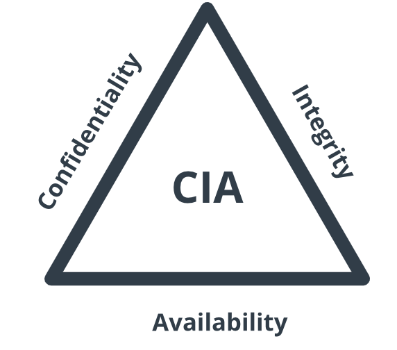
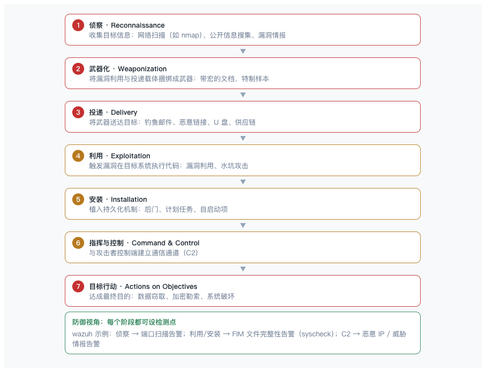
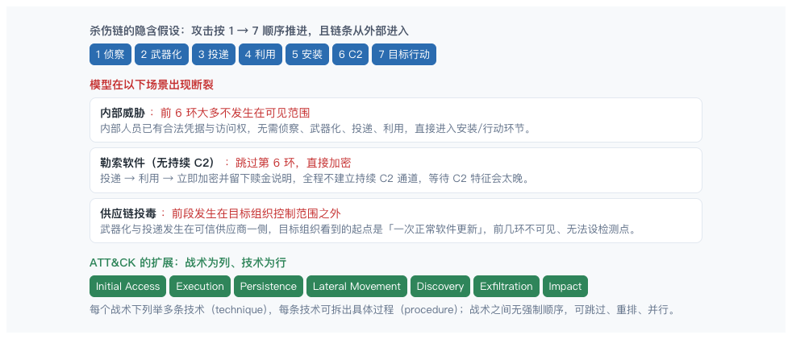
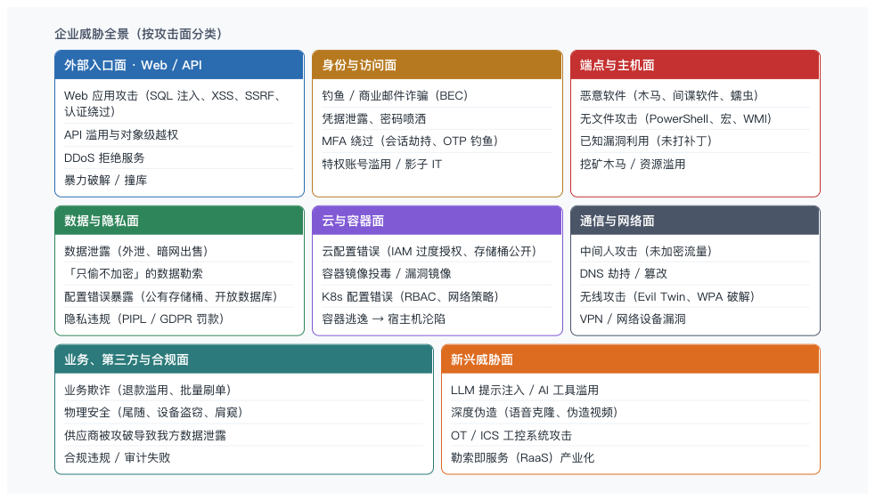
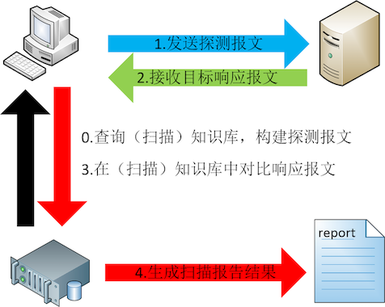
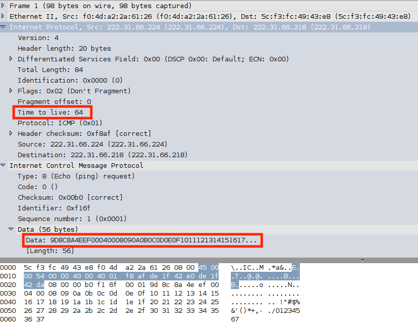

## 安全的目标: CIA

## 安全标准

| 类别 | 标准/框架 |
|---|---|
| 国际权威参考 | NIST 网络安全框架（CSF 2.0）|
| 行业强制 | PCI DSS（支付卡）、HIPAA（美国医疗）、SOX（上市公司内控）|
| 应用安全 | OWASP |
| 隐私与数据 | GDPR（欧盟）、中国《数据安全法》《个人信息保护法》|
| 治理与连续性 | COBIT（IT 治理框架） |

## 杀伤链

洛克希德・马丁公司的**杀伤链**是 2011 年提出的网络攻击生命周期模型，借鉴军事「发现 — 定位 — 跟踪 — 瞄准 — 攻击」的杀伤链思想，把一次入侵拆成七个线性阶段。

**核心价值**：它把模糊的"被入侵"拆解成可枚举的七个环节，从而在每一个阶段设置检测点，任一环被拦截，整条攻击链即被阻断。

## 杀伤链边界

杀伤链是线性模型，覆盖的是 "外部攻击者渗透" 这类经典路径。
内部威胁、无 C2 阶段的勒索软件、供应链投毒这类场景无法用杀伤链描述。

解决办法：
- 内部威胁靠 UEBA(User and Entity Behavior Analytics), 偏离个人 / 群体正常模式
  - 异常时间访问
  - 大批量下载
  - 首次跨部门访问
- 勒索行为靠 EDR(Endpoint Detection and Response) 监控进程异常行为
  - 某个进程突然批量打开、修改、重命名大量文件（全盘遍历）
  - 大量文件扩展名被改成 `.locked`、`.encrypted`
- 供应链靠治理流程
  - SBOM（Software Bill of Materials, 软件物料清单）
  - 签名验证
  - SLSA (Supply Chain Security Standard, 供应链构建安全)
  - 供应商审计

## ATT&CK

[ATT&CK](https://attack.mitre.org/)

ATT&CK（Adversarial Tactics, Techniques, and Common Knowledge，对抗战术、技术与常识）是 MITRE 维护的**攻击者行为知识库**—— 把真实攻击者在入侵中使用的战术与技术（TTP）系统化、标准化地描述出来，是目前安全行业通用的「攻击行为语言」。

MITRE ATT&CK 框架在更细粒度上扩展了**杀伤链**模型，把每个阶段拆成具体战术、技术和过程，更适合现代检测工程。

## 现代企业面临的威胁

安全治理:

- 威胁建模 (外)
- 资产安全 (内)

## 扫描原理

## 操作系统指纹

## nmap

nmap 是合法且强大的审计工具，但请只在**你有明确授权的目标**上使用：自己的机器、自己的网络、实验室、教学环境、或者签署了渗透测试授权的目标。

未经授权扫描他人系统在多数地区属于**违法行为**，也可能违反平台服务条款。

