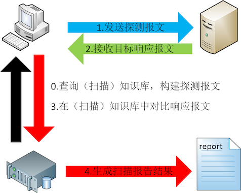

# 法律知识

刑法修正案（七）在刑法第285条中增加两款（第二款、第三款）

> 违反国家规定，侵入前款规定以外的计算机信息系统或者采用其他技术手段，获取该计算机信息系统中存储、处理或者传输的数据，或者
> 对该计算机信息系统实施非法控制，情节严重的，处三年以下有期徒刑或者拘役，并处或者单处罚金；情节特别严重的，处三年以上七年
> 以下有期徒刑，并处罚金。

> 提供专门用于侵入、非法控制计算机信息系统的程序、工具，或者明知他人实施侵入、非法控制计算机信息系统的违法犯罪行为而为其提供
> 程序、工具，情节严重的，依照前款的规定处罚。


# 护网

**护网行动**（也叫 "护网"、业内常称 "HVV/HW"）是由公安机关（公安部网安部门）组织的国家级网络安全实战攻防演习，自 2016 年起常态化开展，一般安排在每年年中到秋季，全国范围内的政府机关、金融、能源、交通、运营商等关键信息基础设施单位都要参加。

核心目的: 

- 用真实的攻击来检验重点单位的网络防护和应急处置能力
- 及时发现并整改深层次的漏洞隐患，检验关键信息基础设施的安全防护水平
- 强化重点单位、社会力量与公安机关的协同作战能力
- 通过实战提高攻防双方的技术对抗、决策指挥和应急处置能力

<html style="margin:0;padding:0;">
<title>护网行动攻防演练结构示意</title>
<div style="width:100%;box-sizing:border-box;font-family:-apple-system,'PingFang SC','Microsoft YaHei',sans-serif;background:#f7f9fc;padding:20px 16px;border-radius:12px;">
  <div style="font-size:16px;font-weight:700;color:#1a202c;text-align:center;">护网行动：国家级网络安全实战攻防演习（示意）</div>
  <div style="font-size:12px;color:#718096;text-align:center;margin:4px 0 16px;">组织方定规则 → 红蓝对抗 → 裁判记分 → 整改提升</div>

  <div style="display:flex;justify-content:center;margin-bottom:10px;">
    <div style="background:#2c3e50;color:#fff;border-radius:8px;padding:10px 18px;text-align:center;min-width:240px;">
      <div style="font-weight:700;">公安部（网安部门）· 组织方</div>
      <div style="font-size:13px;opacity:.9;margin-top:4px;">制定规则 · 组建队伍 · 评定成绩 · 通报整改</div>
    </div>
  </div>
  <div style="text-align:center;color:#718096;font-size:13px;margin-bottom:10px;">▼ 下达任务 / 提供支撑</div>

  <div style="display:flex;flex-wrap:wrap;gap:10px;justify-content:center;align-items:stretch;">
    <div style="flex:1;min-width:180px;background:#fdecec;border:2px solid #d64541;border-radius:8px;padding:12px;">
      <div style="font-weight:700;color:#c53030;">红队（攻击方）</div>
      <div style="font-size:13px;color:#555;margin-top:6px;">安全厂商、研究机构的专业队伍，模拟真实黑客，用渗透测试、漏洞挖掘、0day 等手段"不限路径"发起攻击，拿到权限或数据即得分</div>
    </div>
    <div style="display:flex;align-items:center;font-size:14px;color:#2c3e50;font-weight:600;">实网攻击 →</div>
    <div style="flex:1;min-width:180px;background:#eef4ff;border:2px solid #2b6cb0;border-radius:8px;padding:12px;">
      <div style="font-weight:700;color:#2b6cb0;">目标单位系统</div>
      <div style="font-size:13px;color:#555;margin-top:6px;">政府、金融、能源、交通、运营商等关键信息基础设施，使用真实生产环境进行演练</div>
    </div>
    <div style="display:flex;align-items:center;font-size:14px;color:#2c3e50;font-weight:600;">← 值守防守</div>
    <div style="flex:1;min-width:180px;background:#e6f4ef;border:2px solid #2f855a;border-radius:8px;padding:12px;">
      <div style="font-weight:700;color:#276749;">蓝队（防守方）</div>
      <div style="font-size:13px;color:#555;margin-top:6px;">被护单位的安全、运维、开发团队，7×24 小时监测流量日志、研判告警、封堵阻断、应急溯源，目标是最小化攻击损失</div>
    </div>
  </div>

  <div style="display:flex;justify-content:center;margin:14px 0;">
    <div style="background:#f3e8ff;border:2px solid #6b46c1;border-radius:8px;padding:10px 18px;text-align:center;min-width:240px;">
      <div style="font-weight:700;color:#553c9a;">紫队（裁判 / 仲裁）</div>
      <div style="font-size:13px;color:#555;margin-top:4px;">规则判定与记分 · 审批关键操作 · 监督"禁止破坏性操作、不得影响业务"</div>
    </div>
  </div>

  <div style="display:flex;flex-wrap:wrap;gap:8px;justify-content:center;margin-top:12px;align-items:center;">
    <div style="background:#fff;border:1px solid #cbd5e0;border-radius:6px;padding:8px 12px;font-size:13px;">发现问题漏洞</div>
    <div style="color:#718096;font-size:14px;">→</div>
    <div style="background:#fff;border:1px solid #cbd5e0;border-radius:6px;padding:8px 12px;font-size:13px;">限时整改</div>
    <div style="color:#718096;font-size:14px;">→</div>
    <div style="background:#fff;border:1px solid #cbd5e0;border-radius:6px;padding:8px 12px;font-size:13px;">通报与考核</div>
    <div style="color:#718096;font-size:14px;">→</div>
    <div style="background:#e6fffa;border:1px solid #319795;border-radius:6px;padding:8px 12px;font-size:13px;font-weight:600;color:#234e52;">提升整体防护能力</div>
  </div>
</div>
</html>

---

# 🛡️ Lesson 03

有人在扫描你的网络——你能看见吗？

---

## 杀伤链


## 扫描

**每个端口 = 一个潜在入口：**

| 端口 | 常见服务 | 风险 |
|------|---------|------|
| 22 | SSH | 远程管理入口 |
| 80 | HTTP | Web 服务 |
| 3306 | MySQL | 数据库（不应暴露） |
| 3000 | Node.js | 应用服务 |

**常见工具：** `nmap`

> 端口扫描本身不造成破坏，但它是攻击的**侦察阶段**。

## 信息搜集

信息收集的目标：

- 目标主机: 获取其端口的开放情况和网络服务的详细信息
- 目标网络: 网络拓扑结构
- 目标应用/服务以及目标人: 收集了解目标人的行为习惯、兴趣爱好，是进行针对性社会工程学攻击的必要条件 

## 扫描原理




## NIDS 上线

```
  ☠️ 攻击者
       ▼
┌──────────────┐
│  WAF (Nginx) │  ← 应用层防护（已有）
└──────┬───────┘
       ▼
┌──────────────┐     ┌──────────────────┐
│ Juice Shop   │     │   Suricata (NIDS)│  ← 新防线
│              │────▶│  监控网络流量     │
└──────────────┘     │  检测端口扫描     │
                     │  生成 EVE 告警    │
                     └──────────────────┘
```


---

## NIDS vs WAF 互补

| 攻击类型 | WAF 能看到？ | NIDS 能看到？ |
|----------|-------------|--------------|
| SQL 注入 | ✅ | ❌ |
| XSS | ✅ | ❌ |
| 端口扫描 | ❌ | ✅ |
| 网络协议攻击 | ❌ | ✅ |
| DDoS | ❌ | ⚠️ 部分 |

> **WAF 工作在应用层（HTTP），NIDS 工作在网络层（TCP/IP）。它们互补，不替代。**

---

## 关键概念：Suricata

**Suricata** — 高性能开源 IDS/IPS，支持多线程处理。

**核心能力：**
- 端口扫描检测（行为分析）
- 网络攻击特征匹配（ET 规则集）
- 协议异常检测
- 流量分析

---

## 关键概念：NIDS 是什么

**NIDS (Network Intrusion Detection System)** — 网络入侵检测系统。

**工作原理：**
```
网络流量 → Suricata 抓包 → 规则/行为匹配 → 生成告警
```

**NIDS 如何检测端口扫描：**
> 短时间内对同一主机的多个端口发起连接 → 行为模式识别 → 生成端口扫描告警

**不是基于规则匹配，而是基于行为分析。**

---

## 动手验证

```bash
cd lesson-03
docker compose up -d

# 运行攻击演示
bash attack.sh

# 手动扫描
nmap -sT localhost -p 80,3000

# 查看 Suricata 告警
docker compose exec suricata cat /var/log/suricata/eve.json | grep "alert"
```

---

## 扫描的意义

获得系统信息，寻找漏洞

CVE

ATT&CK

---

## CISO 观察记录

| 检查项 | 状态 | 备注 |
|--------|------|------|
| WAF | ✅ | 保护 HTTP 层 |
| NIDS | ✅ | Suricata 监控流量 |
| 端口扫描 | 🛡️ | 告警触发 |
| 主机威胁 | ❌ | 文件篡改不知道 |

> **NIDS 看网络层，WAF 看应用层。两者结合，才能看到更多威胁。**

---

## 下一课

→ NIDS 上线了，但**如果攻击者已经进来了怎么办？**

端口扫描只是侦察。如果攻击者已获得主机访问权限，开始篡改文件、植入后门……

**NIDS 看不到主机内部发生了什么。** 下一课部署 **HIDS（主机入侵检测系统）**。
