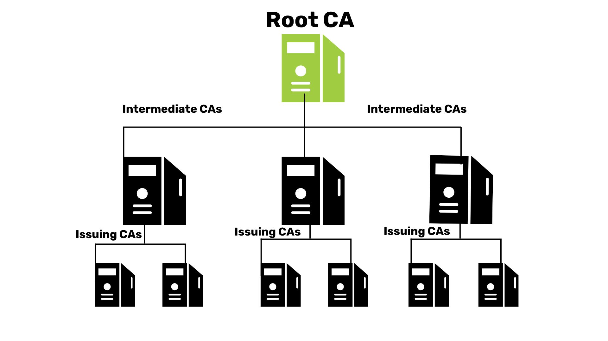
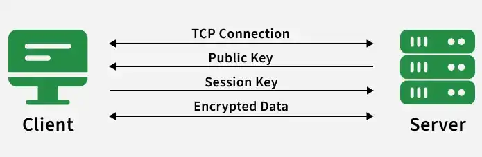

## 完整性

- 密码学工具箱
    - 随机数
    - 对称密码
    - 公钥密码
    - 散列函数
    - 消息认证码
    - 数字签名
- PKI
- GPG
- 可信计算
    - TPM
    - Secure Boot
- Wazuh (HIDS)

## 密码学工具箱

- openssl
- Bouncy Castle (BC)
- Tongsuo

查看 openssl 演示 misc/crypto_demo

## PKI

PKI（Public Key Infrastructure，公钥基础设施）是一套用于管理公钥、数字证书和信任关系的体系。
它解决的核心问题是：当我们拿到一个公钥时，如何确认这个公钥确实属于它声称的那个人或服务器？

### 为什么需要 PKI？

假设你访问一个 HTTPS 网站，服务器向浏览器提供了一个公钥。

如果没有可信的验证机制，攻击者可以冒充该网站，提供自己的公钥。浏览器即使成功使用这个公钥建立加密连接，也无法确定连接的对端是真正的网站。

所以，需要一套机制来验证公钥与身份之间的关联。

**PKI 核心组件**

- 公钥与私钥： 私钥由持有者保护，公钥可以公开。它们可以用于数字签名、验证签名，以及在适用的算法中进行加密或密钥交换
- 数字证书： 将身份信息与公钥关联起来，并由证书颁发机构（CA）进行数字签名
- 证书颁发机构（CA）： 按照一定的验证流程签发证书，建立公钥与身份之间的可信关联
- 证书链： 通过中间 CA 和根 CA 建立信任关系。**操作系统或浏览器通常预先信任一组根证书**
- 证书验证与撤销机制： 检查证书的签名、有效期、用途、域名等条件，并在适用时检查证书是否已被撤销

### HTTPS

当浏览器访问 https://example.com 时，简化后的流程如下：

1. 服务器向浏览器提供包含其公钥的数字证书
2. 浏览器验证证书的签名链是否连接到可信的根 CA
3. 浏览器检查证书是否适用于当前域名、是否在有效期内，以及其他必要的验证条件
4. 验证通过后，浏览器继续执行 TLS 握手，通过密钥交换等机制建立会话密钥
5. 后续通信使用协商出的会话密钥保护数据

需要注意，现代 HTTPS 通常不会直接用服务器证书中的公钥加密所有通信数据。证书主要用于认证服务器身份，TLS 再通过密钥交换等机制建立安全连接。
