# 🛡️ Lesson 04

## 文件被篡改了

---

## 回顾：当前安全链路

```
攻击者 → WAF → Juice Shop → Suricata (NIDS)
                  ↓
             Wazuh Agent (新课)
```

WAF + NIDS 都已部署。但如果攻击者已经进了主机呢？

---

## PKI 和密码应用

密码学工具箱

- 随机数
- 对称密码: AES, SM4
- 公钥密码: RSA, ECC, SM2
- 散列函数: MD5, SHA1, SHA256, SM3
- 消息认证码: HMAC
- 数字签名: ECDSA, RSA, SM2

## 公钥验签

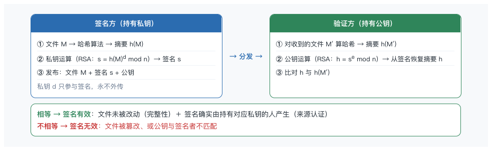

```java
byte[] data      = Files.readAllBytes(Path.of(args[0])); // 原始文件
byte[] signature = Files.readAllBytes(Path.of(args[1])); // 签名（二进制）
byte[] pubKeyDer = Files.readAllBytes(Path.of(args[2])); // 公钥（X.509 SubjectPublicKeyInfo 编码）

PublicKey publicKey = KeyFactory
  .getInstance("EC", "BC")
  .generatePublic(new X509EncodedKeySpec(pubKeyDer));

Signature verifier = Signature.getInstance("SHA256withECDSA", "BC");
verifier.initVerify(publicKey);
verifier.update(data);

boolean valid = verifier.verify(signature);
System.out.println("签名验证结果: " + (valid ? "有效" : "无效"));
```

## PKI

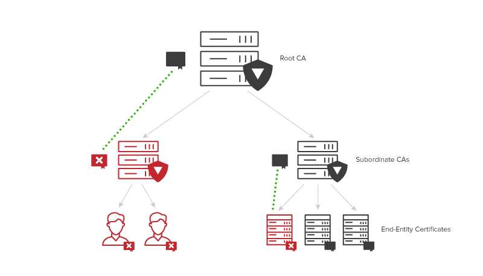

## GPG 


历史

- 1991 年：[Phil Zimmermann](https://www.philzimmermann.com/EN/background/index.html) 发布 PGP（Pretty Good Privacy），首个面向大众的公钥加密软件
- 1993 年：因美国 "密码出口管制" 被调查，Zimmermann 把 PGP 源码印成书出版（书籍不受出口管制）
- 1996 年：IETF 制定 OpenPGP 标准（RFC 4880），统一了格式，让不同 PGP 实现可以互通
- 1997 年：完全自由开源的 OpenPGP 实现成为 Linux 生态的事实标准并沿用至今

GPG（GNU Privacy Guard）是 **OpenPGP 标准的开源实现**，提供数据的**加密**与**数字签名**能力

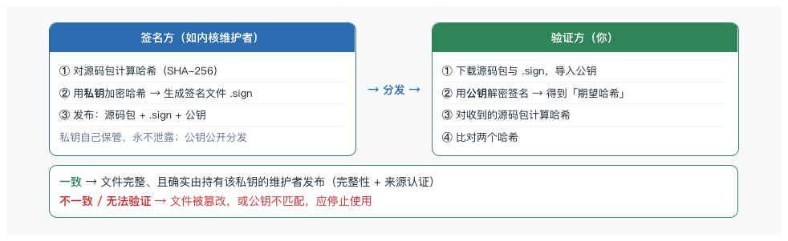

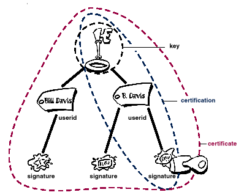

Linux 内核分发时附带的 `.sign` 文件，就是维护者用 GPG 私钥对源码包做的签名 —— 它的作用只有一个：**让你确认下载的文件确实来自内核维护者，且没有被任何人篡改过**。

关键安全点:

- 验证签名的前提是**公钥可信**

## 完整性应用 

- [ubuntu iso](https://cdimage.ubuntu.com/ubuntu/releases/24.04.5/release/)
- [linux kernel](https://www.kernel.org/)

### linux kernel 验签演示

```bash

# import keys belonging to Linus Torvalds and Greg Kroah-Hartman
# Note: 这一步只是 "按邮箱地址从密钥服务器检索并导入公钥"，它不包含任何来源认证
gpg --locate-keys torvalds@kernel.org gregkh@kernel.org

# list imported keys
gpg -k

# download kernel source
# https://www.kernel.org/
unxz linux-7.2.8.tar.xz
gpg --verify linux-7.2.8.tar.sign

```

[确认签名是否可信](https://www.kernel.org/category/signatures.html)

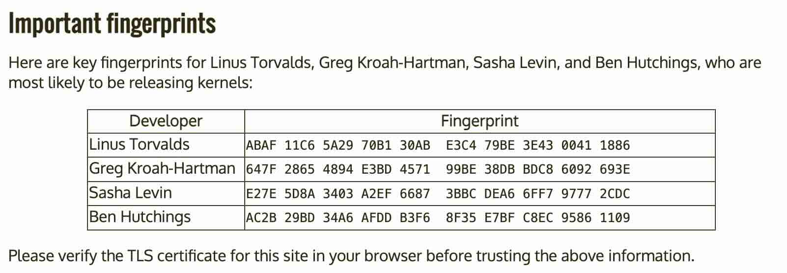

## 可信计算

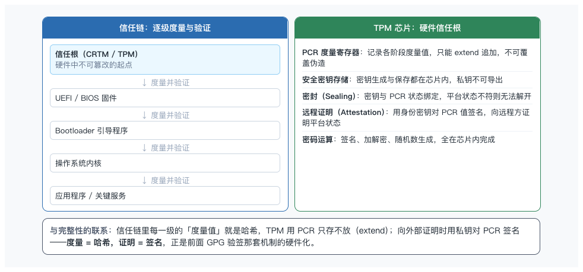

- TPM
- Secure Boot
- Linux IMA
- 可信计算 2.0/3.0

可信计算（Trusted Computing）的核心思想一句话：信任不能凭空产生，必须从一个可信的起点逐级建立
- 它通过 "信任根 → 信任链 → 度量与报告"，让系统每一级的启动过程可度量、可验证、可证明
- TPM 芯片就是承载这个体系的**硬件信任根**

### TPM

TPM: Trusted Platform Module

它是焊在主板上的**专用安全芯片**，本质是一个带防篡改能力的密码协处理器。

由 TCG（可信计算组织）制定规范，经历了 TPM 1.2 到 TPM 2.0 的演进 ——TPM 2.0 在算法选择、密钥层级、使用灵活性上做了大幅扩展，是当前主流系统的标准配置。

核心功能

- PCR 度量寄存器
  - 保存启动链各级的度量哈希
  - 关键是 "只增不改" —— 新值只能通过 `PCR_new = hash(PCR_old || 度量值)` 追加，无法直接写入一个任意值
- 安全密钥存储
  - 平台密钥（背书密钥 EK、存储根密钥 SRK）、应用密钥都在芯片内生成、保存在芯片内
  - 私钥永远不离开芯片，即使系统被攻陷也取不走
- 密封（Sealing）
  - 把密钥与一组 PCR 值绑定 —— 只有当平台处于「预期状态」（PCR 匹配）时密钥才释放
- 远程证明（Remote Attestation）
  - 平台用身份密钥对当前 PCR 值签名，远程服务器验证签名后就能判断 "这台机器是否运行着预期版本的固件和系统"
- 密码运算
  - 芯片内完成 RSA/ECC 签名、加解密、真随机数生成

典型使用场景

- Windows BitLocker：磁盘加密密钥密封进 TPM，开机引导链完整才自动解锁
- Secure Boot：UEFI 用签名验证引导程序
- Linux IMA/EVM：IMA 在内核层对文件做完整性度量并 extend 进 PCR
- 远程证明与云安全：服务器向平台方证明自身固件 / 系统状态可信，用于设备身份认证、安全启动基线校验

### Secure Boot

Secure Boot 可信计算 "信任链" 思想的直接落地 

- UEFI 规范内定义的一项安全特性（从 UEFI 2.3.1 起成为规范的一部分） 
- 用签名验证实现了 "每一级验证下一级、通过才移交控制权"

Virtual Box Secure Boot 配置

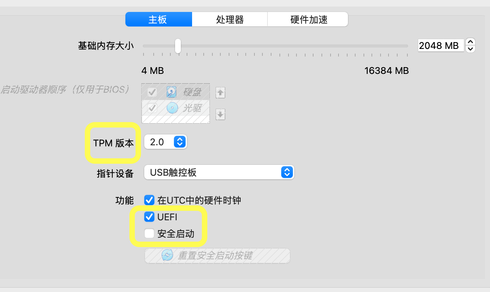


UEFI（Unified Extensible Firmware Interface，统一可扩展固件接口）是定义操作系统与固件之间接口的行业标准 —— 它规定固件如何初始化硬件、如何把控制权交给引导程序、以及引导程序如何调用固件服务。它解决了传统 BIOS 时代的种种限制：磁盘容量上限（GPT 分区摆脱了 2TB 限制）、可扩展驱动模型（模块化的 DXE 驱动）、更灵活的启动流程等。

UEFI 启动流程

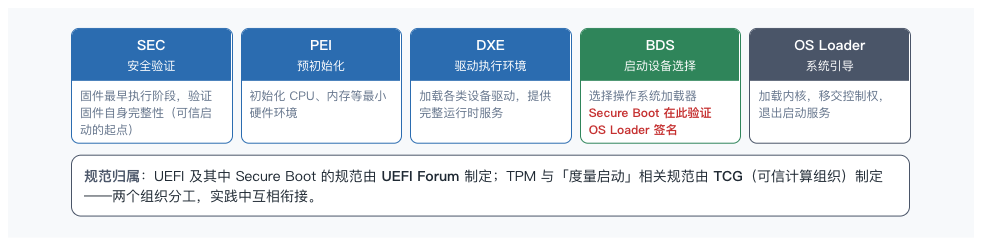

Secure Boot 验证机制

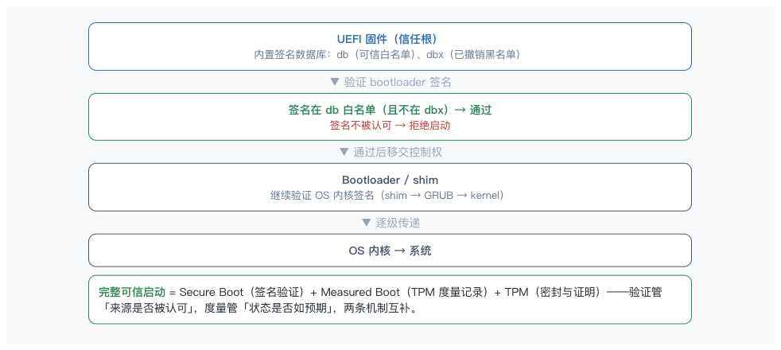

- Microsoft：Windows 8 起把 **支持 Secure Boot** 作为 OEM 认证要求，是 Secure Boot 大规模普及的主要推手；同时运营 UEFI 签名数据库（UEFI CA）并为 Linux 生态的 shim 签名
- Linux Foundation / 各发行版：为解决 "Linux 引导程序没有 Microsoft 签名" 的问题，采用 shim 机制 ——shim 由 Microsoft 签名，shim 再信任各发行版自己的密钥，实现 Linux 在 Secure Boot 下的合法启动

### Bootkit & RootKit

- Bootkit: 恶意代码隐藏在启动链里（引导程序、MBR、UEFI 固件），在操作系统加载**之前**就已经运行
- Rootkit: 核心特征是藏在系统底层，隐藏自己的进程、文件、网络连接和系统痕迹，让杀毒软件和安全分析看不到它

Secure Boot 与 可信计算把 bootkit & rootkit 的门槛大幅抬高

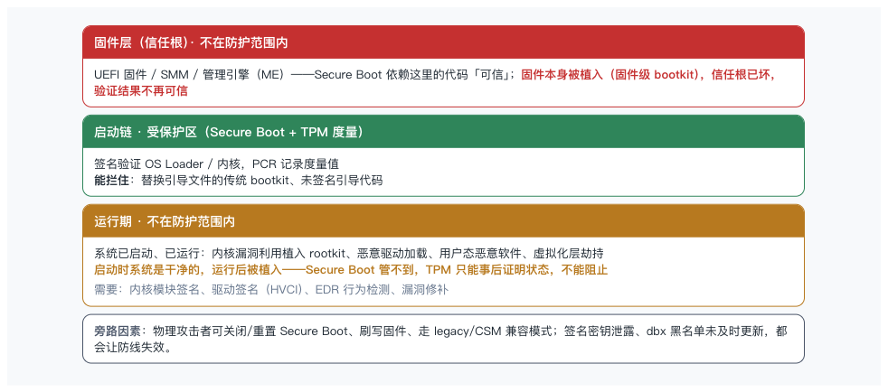

## HIDS

```
┌──────────────┐          ┌──────────────────┐
│ Juice Shop   │          │  Wazuh Agent     │
│              │───-----─▶│  (HIDS)  ← 新防线 │
└──────────────┘          │  监控文件变化      │
                          │  监控进程         │
                          │  FIM 实时告警     │
                          └──────────────────┘
```

---

## Wazuh

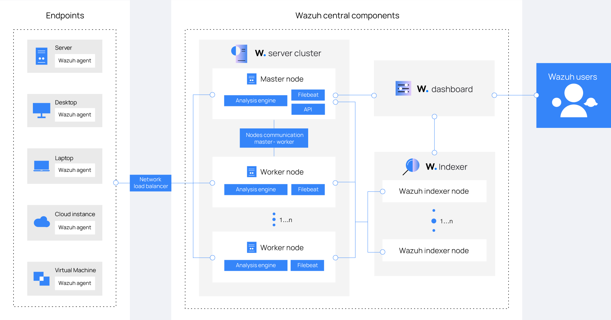

### Wazuh Agent 

Wazuh Agent 部署在受监控主机上的轻量级代理。

**核心功能：**
- **文件完整性监控 (FIM)** — 监控关键文件的创建、修改、删除
- **日志监控** — 收集和分析系统日志
- **进程监控** — 检测可疑进程
- **Rootkit 检测** — 扫描系统中可能存在的 Rootkit

**Wazuh Agent 告警类型：**

| 来源 | Rule | 含义 |
|------|------|------|
| syscheck (FIM) | 550 | 文件校验和变化 |
| syscheck (FIM) | 553 | 文件被删除 |
| syscheck (FIM) | 554 | 新增文件 |
| SCA | 19007-19009 | CIS 安全基线合规检查 |
| ossec | 501/502 | Agent 上下线、Manager 启动 |

### FIM

FIM (File Integrity Monitoring): 文件完整性监控，持续监控关键文件和目录的变化

工作原理

```
第 1 轮（基线）              第 2 轮（对比）
遍历监控目录 ───────→ 建立基线 ───────→ 再次遍历
                       ↓                  ↓
               记录每个文件的：       与基线逐条对比：
               • MD5/SHA256          • 文件不在基线 → 新增 (Rule 554)
               • 权限/UID/GID         • hash 变了     → 修改 (Rule 550)
               • inode/mtime          • 基线文件消失 → 删除 (Rule 553)
               ↓                  ↓
               无告警（仅建库）      发现差异 → 生成告警 → 发送至 Manager
```

关键要点：

篡改必须发生在基线建立**之后**，才能被检测为"变化"。如果篡改与基线扫描同时进行，文件会被当作正常状态收录，不会产生告警

### wazuh 监控日志示例

```json
{
    "timestamp": "2026-10-02T05:14:39.355+0000",
    "rule": {
        "level": 7,
        "description": "Integrity checksum changed.",
        "id": "550",
        "mitre": {
            "id": [
                "T1565.001"
            ],
            "tactic": [
                "Impact"
            ],
            "technique": [
                "Stored Data Manipulation"
            ]
        },
        "firedtimes": 3,
        "mail": false,
        "groups": [
            "ossec",
            "syscheck",
            "syscheck_entry_modified",
            "syscheck_file"
        ],
        "pci_dss": [
            "11.5"
        ],
        "gpg13": [
            "4.11"
        ],
        "gdpr": [
            "II_5.1.f"
        ],
        "hipaa": [
            "164.312.c.1",
            "164.312.c.2"
        ],
        "nist_800_53": [
            "SI.7"
        ],
        "tsc": [
            "PI1.4",
            "PI1.5",
            "CC6.1",
            "CC6.8",
            "CC7.2",
            "CC7.3"
        ]
    },
    "agent": {
        "id": "001",
        "name": "63e43fd43ec1",
        "ip": "172.20.0.3"
    },
    "manager": {
        "name": "d156ece1bea2"
    },
    "id": "1790918079.707255",
    "full_log": "File '/monitored/juice-shop/package.json' modified\nMode: scheduled\nChanged attributes: permission\nPermissions changed from 'rw-r--r--' to 'rwxrwxrwx'\n",
    "syscheck": {
        "path": "/monitored/juice-shop/package.json",
        "mode": "scheduled",
        "size_after": "7276",
        "perm_before": "rw-r--r--",
        "perm_after": "rwxrwxrwx",
        "uid_after": "65532",
        "gid_after": "0",
        "md5_after": "f3ca1fc020cbabea8a2b48a6d269e39c",
        "sha1_after": "7975196e5bb00d799955e9d47a669a168e96077d",
        "sha256_after": "e582b8e132fb6fa82e10f496e8ee55c8d9617f4ba19fc50ad87547bf8d281d87",
        "gname_after": "root",
        "mtime_after": "2026-08-11T05:21:02",
        "inode_after": 134237,
        "changed_attributes": [
            "permission"
        ],
        "event": "modified"
    },
    "decoder": {
        "name": "syscheck_integrity_changed"
    },
    "location": "syscheck"
}
```

监控目录里的 `/monitored/juice-shop/package.json` 被检测到发生了修改:
- 权限从 `rw-r--r--`（644）变成了 `rwxrwxrwx`（777）
- 规则级别 7（高）
- 已触发 3 次

**关键字段解读**

| 字段 | 值 | 含义 |
|---|---|---|
| `rule.level` | 7 | 告警级别（1–3 低，4–6 中，7–9 高），属于**较高关注度**的事件 |
| `rule.description` | 550 / Integrity checksum changed | syscheck 的标准「完整性校验和变化」规则 |
| `rule.firedtimes` | 3 | 这条规则已经命中 3 次，说明**同类事件此前已发生过**，不是孤立一次 |
| `rule.mitre` | T1565.001 Impact / Stored Data Manipulation | 映射到 MITRE ATT&CK「存储数据操纵」，即攻击者篡改存储数据的手法 |
| `rule.groups` | syscheck, syscheck_entry_modified... | 规则所属分组，用于告警分类与过滤 |
| 合规字段 | pci_dss 11.5 / gdpr II_5.1.f / hipaa / nist_800_53 SI.7 等 | 这条告警同时满足多个合规框架的日志与完整性要求 |
| `agent` | id 001, name 63e43fd43ec1, ip 172.20.0.3 | 事件源：容器内的 agent（Docker 网络地址） |
| `manager` | d156ece1bea2 | 上报到的管理端节点 |
| `syscheck.perm_before/after` | rw-r--r-- → rwxrwxrwx | 权限变更的具体前后值 |
| `syscheck.changed_attributes` | ["permission"] | 只有权限变了，文件内容没有变 |
| `syscheck.*_after` 哈希 | md5/sha1/sha256 | 变更后的校验和，可用于与已知合法值比对 |
| `syscheck.mtime_after` | 2026-08-11 | 文件内容修改时间，注意它停留在 8 月 |
| `decoder` / `location` | syscheck_integrity_changed / syscheck | 解码器与来源模块，均为 syscheck 标准链路 |

---

## 三层防御对比

| 威胁类型 | WAF | NIDS | HIDS |
|----------|-----|------|------|
| SQL 注入 | ✅ | ❌ | ❌ |
| 端口扫描 | ❌ | ✅ | ❌ |
| 文件篡改 | ❌ | ❌ | ✅ |
| 可疑进程 | ❌ | ❌ | ✅ |
| Rootkit | ❌ | ❌ | ✅ |

---

## 下一课

→ HIDS 上线了，但你遇到了一个新问题：**你有 4 个安全组件，每个都在产生日志。**

WAF 日志、Suricata 日志、Wazuh Agent 日志、应用访问日志……

**攻击者同时触发了多个组件的告警，但你无法把它们关联起来。**

下一课部署 **SIEM，将所有日志集中到一个平台进行关联分析。**

---

## 参考资料

| 文档 | 链接 |
|------|------|
| Wazuh FIM 官方文档 | https://documentation.wazuh.com/current/user-manual/capabilities/file-integrity/index.html |
| FIM 配置指南 | https://documentation.wazuh.com/current/user-manual/reference/ossec-conf/syscheck.html |
| FIM 告警 Rule ID | https://documentation.wazuh.com/current/rule-reference/ruleset-fim.html |
| Wazuh Agent 安装 | https://documentation.wazuh.com/current/installation-guide/wazuh-agent.html |
| Wazuh 架构 | https://documentation.wazuh.com/current/getting-started/architecture.html |

