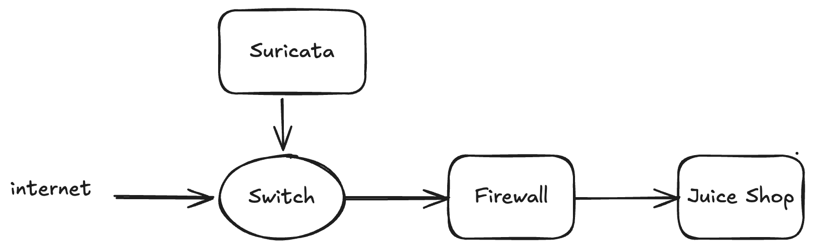
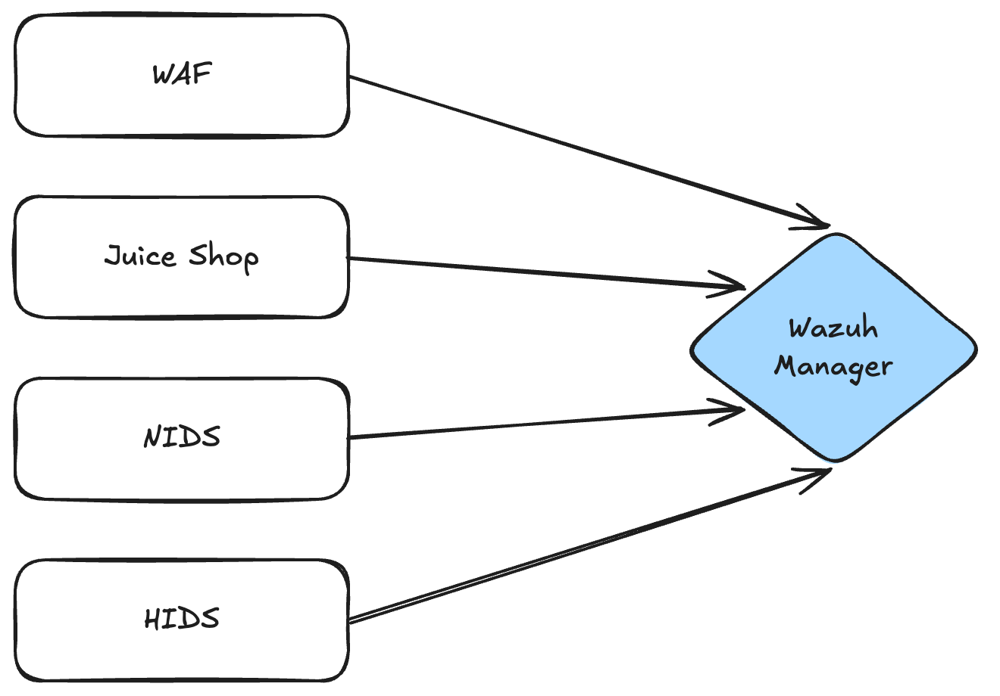
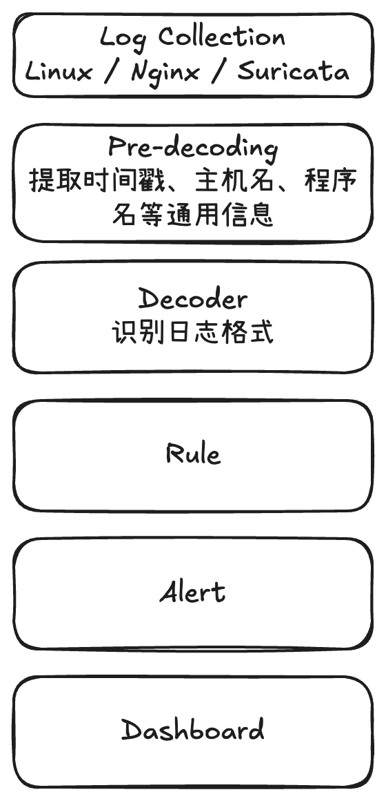
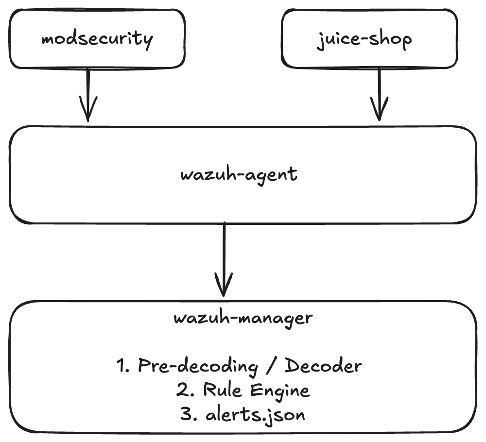

# 🛡️ Lesson 05

## 回顾：当前安全链路



WAF/NIDS/HIDS/应用都已部署，而且每个都在产生日志：

- WAF: ModSecurity 日志
- NIDS: Suricata 日志
- HIDS: Wazuh Agent 日志
- 应用: 访问日志

Q：分散的日志形态，对于攻击者同时触发多个告警，如何实现关联 ？

---

## SIEM (Security Information and Event Management)



**定义**

SIEM 是一套集中采集、归一化、存储、关联分析全网设备日志，生成安全告警，支持审计取证的安全平台，核心是把分散在各处的安全日志汇总起来做分析。

**核心能力**

- 多源日志采集：网络设备、服务器、操作系统、中间件、数据库、云、应用系统日志
- 日志归一化：不同厂商日志格式五花八门，SIEM 统一字段，方便检索
- 日志长期存储：满足合规留存要求，用于事后溯源取证
- 关联规则引擎：基于规则识别已知攻击场景
- 告警管理：告警聚合、去重、工单流转
- 合规报表：等保、PCI-DSS、行业审计报表
- 日志检索：事件发生后，快速检索原始日志排查

**SIEM 的典型局限**

- 数据源大多是日志，缺少深度行为上下文: 只能看到设备上报的事件，看不到终端进程
- 以规则驱动为主，大量误报: 零日攻击, APT 检出能力弱
- 原生没有响应能力: 只会输出告警，不能直接隔离主机、封禁账号、阻断 IP

**补齐短板**

- 终端深度行为: EDR (终端检测与响应)
- 自动响应: SOAR (安全编排、自动化与响应)
  - SIEM产生告警 → 推送到SOAR平台 → SOAR调用各安全设备API执行处置
- 攻击链还原
- 未知威胁狩猎: UEBA

---

## SIEM: Wazuh


Wazuh 是一个开源的安全监控与威胁检测平台，用于集中分析主机、应用和其他安全设备产生的日志与事件，帮助安全团队发现威胁、调查事件并满足合规要求。

可以把它理解为一个轻量级的安全运营平台，集成了主机安全监控、日志分析、入侵检测和安全事件告警等能力。

Wazuh 能做什么
- HIDS: 监控主机上的文件变更、可疑活动和安全配置等。例如，检测关键系统文件是否被意外修改
- 日志分析与威胁检测: 解析来自 SSH、Web 服务和其他应用的日志，通过规则识别登录失败、可疑访问和潜在攻击行为
- 漏洞与安全配置检查: 检查已知软件漏洞、系统安全配置和合规性问题，帮助运维团队发现需要修复的风险
- SIEM 与安全运营: 汇总不同来源的安全事件，提供告警检索、事件调查和安全态势可视化能力

Q: Wazuh 如何处理不同数据源的日志？

- Juice Shop
- ModSecurity
- 其他 ...

## Wazuh 日志处理



## Decoder 工作原理

假设 Linux SSH 服务产生了这样一条原始日志：

```sh
Feb 14 12:19:04 server sshd[25474]:
Accepted password for alice from 192.168.1.133 port 49765 ssh2
```

Decoder 处理后，可以得到类似这样的结构化数据：

```json
{
  "program_name": "sshd",
  "dstuser": "alice",
  "srcip": "192.168.1.133",
  "srcport": "49765"
}
```

Wazuh 支持多种解析方式：
- 预置 Decoder：Wazuh 已经提供常见日志格式的解析定义
- 正则表达式：使用匹配规则从非结构化文本中提取字段
- JSON Decoder：解析 JSON 格式的字段
- 自定义 Decoder：针对尚未支持的应用日志编写解析规则

## Decoder 和 Rule

| 组件      | 核心问题           | 职责           |
| ------- | -------------- | ------------ |
| Decoder | 这条日志包含什么信息？    | 解析、提取字段      |
| Rule    | 这条日志意味着什么？     | 判断事件是否匹配安全规则 |
| Alert   | 需要把什么事件交给安全人员？ | 记录符合告警条件的事件  |

> **Note**
> Decoder 不负责判断攻击是否发生, 它可以帮助识别和提取事件信息
> 安全判断主要由 Rule 及其关联条件完成

举一个 SSH 暴力破解的例子：

1. 原始日志

`Failed password for alice from 192.168.1.133`

2. Decoder

提取出登录结果、用户名 `alice`、源 IP `192.168.1.133` 等信息。

3. Rule

根据规则匹配登录失败事件；如果进一步结合重复次数、时间窗口或其他条件，可以识别可疑的连续失败行为。

4. Alert

如果匹配到相应告警规则，生成包含事件描述、等级和相关字段的安全告警。

---

## 深度思考：日志格式变了怎么办？

**Q：如果 ModSecurity、Juice Shop 或 Suricata 修改了日志格式，Wazuh 的 Decoder 不就失效了吗？**

有可能。即使日志仍然能够被解析，字段变化也可能导致原有检测规则无法正常工作。

### 为什么日志格式通常比较稳定？

日志格式是应用与下游分析系统之间的接口。

- Apache、Nginx 支持常见的访问日志格式，也允许用户自定义输出
- ModSecurity、Suricata 等项目定义了各自的日志格式，例如 JSON
- Syslog、CEF、LEEF 等格式有助于不同系统之间交换日志

这些约定降低了集成成本，但**不意味着所有格式和字段永远不变**。升级应用时，仍需要关注日志格式与字段定义的变化。

### Decoder 提供了解耦，但不是完全的兼容性保障

```text
原始日志
   ↓
Decoder：解析并提取字段
   ↓
结构化事件
   ↓
Rule：匹配条件并判断事件
   ↓
Alert：生成安全告警
```

如果上游修改了日志格式：

- 如果只改变了日志的外部表示，而解析后的字段和语义保持不变，通常只需要调整 Decoder
- 如果字段名称、字段类型或事件语义发生变化，可能需要同时修改 Decoder 和 Rule
- 如果日志解析成功，但规则已经无法识别新事件，还可能出现安全告警漏报

因此，Decoder 的价值在于分离日志解析与规则判断，而不是保证上游变化永远不会影响下游。

### 自定义日志怎么处理？

常见做法有三种：

- **自定义 Decoder**：为 Wazuh 尚未支持的日志格式编写解析规则
- **调整日志输出**：如果应用支持配置，优先使用稳定、结构化的格式，例如 JSON
- **使用日志转换管道**：必要时通过 Fluentd、Logstash 或 Vector 转换日志，再交给 SIEM

选择哪种方式，取决于应用的能力、日志规模和现有架构。

### 真实环境中如何保证升级安全？

不能只确认 Decoder 没有报错，还需要验证整个检测链路。

1. 保存有代表性的原始日志样本
2. 使用 `wazuh-logtest` 验证 Decoder 和 Rule 的匹配结果
3. 应用升级后，使用新版本的日志样本重新测试
4. 检查关键事件是否仍然触发预期告警
5. 监控日志量、解析异常和告警数量，及时发现异常变化

核心结论：Decoder 将日志解析与检测规则分离，降低了维护成本；但真正的兼容性，需要通过字段约定、规则设计和回归测试来保证。

## 总结：SIEM 到底做了什么？

回顾本课的实验目的：将分散在不同组件中的安全日志汇聚起来，解析日志内容，通过规则识别安全事件，并统一查看告警。



### 日志收集器 vs SIEM

| 维度 | 日志收集器 | SIEM（以 Wazuh 为例） |
|---|---|---|
| 核心职责 | 采集、传输日志 | 分析安全事件、识别威胁 |
| 输入 | 日志文件、事件流等 | 原始日志、结构化事件等 |
| 主要处理 | 读取、转发、必要的转换 | 解析、规则匹配、事件关联 |
| 输出 | 转发后的日志 | 安全告警，以及按配置保存的事件 |
| 核心价值 | 让日志到达目的地 | 帮助安全人员判断哪些事件值得调查 |

两者不是互斥的：Wazuh Agent 自身就包含 Logcollector，而 Wazuh Manager 进一步负责事件分析与告警。

### 接入新日志源

**传输 → 解析 → 检测**

```text
日志接入                 事件解析                 安全检测
   │                        │                       │
   ▼                        ▼                       ▼
Agent / localfile       Decoder                Rule
   │                        │                       │
   ▼                        ▼                       ▼
读取原始日志             提取结构化字段          匹配检测条件
```

| 步骤 | 主要配置 | 作用 |
|---|---|---|
| 传输与采集 | Docker volume、`ossec.conf` 中的 `<localfile>` | 让 Agent 能够读取目标日志 |
| 解析 | 内置 Decoder 或自定义 Decoder | 提取源 IP、URL、事件类型等字段 |
| 检测 | 内置规则或 `local_rules.xml` 中的自定义规则 | 判断事件是否符合检测条件，必要时生成告警 |

不是每种日志都必须编写自定义 Decoder。Wazuh 可能已经提供适用的解析器；JSON 日志也可以使用内置 JSON Decoder。

### 为什么日志格式变化会影响检测？

假设应用原来输出：

```json
{
  "event_type": "login_failed",
  "src_ip": "192.0.2.10"
}
```

Decoder 将它解析为结构化字段，Rule 根据 `event_type` 判断是否为登录失败。

如果应用升级后将字段改为 `event` 和 `source.ip`，原有 Decoder 或 Rule 就可能需要调整。

因此，接入日志不只是让文件被读取，还需要验证：

- 日志是否被正确解析？
- 关键字段是否符合预期？
- 检测规则是否仍然匹配？
- 预期的安全告警是否能够生成？

### 本课的核心结论

日志被采集，不等于它已经被正确解析；日志被解析，也不等于它已经被识别为安全事件。

SIEM 的价值不只是集中保存日志，而是将不同来源的事件转化为可分析的信息，通过规则检测和事件关联，帮助安全人员发现值得调查的行为。

注意理解：日志采集、日志解析和安全检测是三个不同阶段